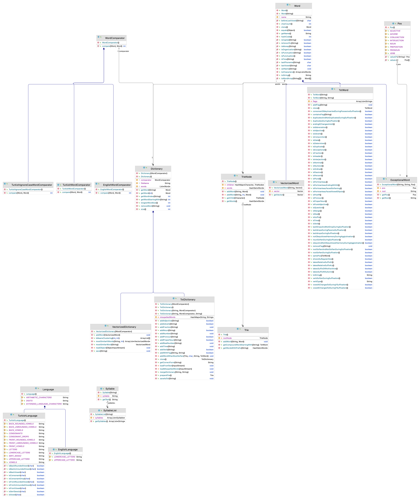

Turkish Dictionary
============

This resource is a dictionary of Modern Turkish, comprised of the definitions of over 50.000 individual entries. Each entry is matched with its corresponding synset (set of synonymous words and expressions) in the Turkish WordNet, KeNet.

The bare-forms in the lexicon consists of nouns, adjectives, verbs, adverbs, shortcuts, etc. Each bare-form appears the same in the lexicon except verbs. Since the bare-forms of the verbs in Turkish do not have the infinitive affix ‘mAk’, our lexicon includes all verbs without the infinitive affix. The bare-forms with diacritics are included in two forms, with and without diacritics. For example, noun ‘rüzgar’ appear both as ‘rüzgar’ and ‘rüzgâr’.

Special markers are included as bare-forms such as doc, s, etc.

Some compound words are included in their affixed form. For instance, ‘acemlalesi’ appears as it is, but not as ‘acemlale’.

Foreign words, especially proper noun foreign words, are included, so that the system can easily recognize them as proper nouns. For instance, the words ‘abbott’, ‘abbigail’ are example foreign proper nouns. Including foreign proper nouns, there are 19,000 proper nouns in our lexicon.

From derivational suffixes, we only include words which has taken -lI, -sIz, -CI, -lIk, and -CIlIk derivational affixes. For example, the bare-forms ‘abacı’, ‘abdallık’, ‘abdestli’ and ‘abdestlilik’, are included, since they have taken one or more derivational affixes listed above.

Each bare-form has a set of attributes. For instance, ‘abacı’ is a noun, therefore, it includes CL_ISIM attribute. Similarly, ‘abdestli’ is an adjective, which includes IS_ADJ attribute. If the bare-form has homonyms with different part of speech tags, all corresponding attributes are included.

|Name|Purpose|
|---|---|
|CL ISIM, CL FIIL, IS_OA|Part of speech tag(s)|
|IS_DUP|Part of a duplicate form|
|IS_KIS|Abbreviation, which does not obey vowel harmony while taking suffixes.|
|IS_UU, IS_UUU|Does not obey vowel harmony while taking suffixes.|
|IS_BILES|A portmanteau word in affixed form, such as ‘adamotu’|
|IS_B_SI|A portmanteau word ending with ‘sı’, such as ‘acemlalesi’|
|IS_CA|Already in a plural form, therefore can not take plural suffixes such as ‘ler’ or ‘lar’.|
|IS_ST|The second consonant undergoes a resyllabification.|
|IS_UD, IS_UDD, F_UD|Includes vowel epenthesis.|
|IS_KG|Ends with a ‘k’, and when it is followed by a vowel-initial suffix, the final ‘k’ is replaced with a ‘g’.|
|IS_SD, IS_SDD, F_SD|Final consonant gets devoiced during vowel-initial suffixation.|
|F GUD, F_GUDO|The verb bare-form includes vowel reduction.|
|F1P1, F1P1-NO-REF|A verb, and depending on this attribute, the verb can (or can not) take causative suffix, factitive suffix, passive suffix etc.|

Video Lectures
============

[](https://youtu.be/10iAqbfsA2A)[](https://youtu.be/C-_TZDkFwzQ)


For Developers
============

You can also see [Python](https://github.com/starlangsoftware/Dictionary-Py), [Cython](https://github.com/starlangsoftware/Dictionary-Cy), [C++](https://github.com/starlangsoftware/Dictionary-CPP), [Swift](https://github.com/starlangsoftware/Dictionary-Swift), [C](https://github.com/starlangsoftware/Dictionary-C), [Js](https://github.com/starlangsoftware/Dictionary-Js), [Php](https://github.com/starlangsoftware/Dictionary-Php), or [C#](https://github.com/starlangsoftware/Dictionary-CS) repository.

## Requirements

* [Java Development Kit 8 or higher](#java), Open JDK or Oracle JDK
* [Maven](#maven)
* [Git](#git)

### Java 

To check if you have a compatible version of Java installed, use the following command:

    java -version
    
If you don't have a compatible version, you can download either [Oracle JDK](https://www.oracle.com/technetwork/java/javase/downloads/jdk8-downloads-2133151.html) or [OpenJDK](https://openjdk.java.net/install/)    

### Maven
To check if you have Maven installed, use the following command:

    mvn --version
    
To install Maven, you can follow the instructions [here](https://maven.apache.org/install.html).      

### Git

Install the [latest version of Git](https://git-scm.com/book/en/v2/Getting-Started-Installing-Git).

## Download Code

In order to work on code, create a fork from GitHub page. 
Use Git for cloning the code to your local or below line for Ubuntu:

	git clone <your-fork-git-link>

A directory called Dictionary will be created. Or you can use below link for exploring the code:

	git clone https://github.com/olcaytaner/Dictionary.git

## Open project with IntelliJ IDEA

Steps for opening the cloned project:

* Start IDE
* Select **File | Open** from main menu
* Choose `Dictionary/pom.xml` file
* Select open as project option
* Couple of seconds, dependencies with Maven will be downloaded. 


## Compile

**From IDE**

After being done with the downloading and Maven indexing, select **Build Project** option from **Build** menu. After compilation process, user can run Dictionary.

**From Console**

Go to `Dictionary` directory and compile with 

     mvn compile 

## Generating jar files

**From IDE**

Use `package` of 'Lifecycle' from maven window on the right and from `Dictionary` root module.

**From Console**

Use below line to generate jar file:

     mvn install

## Maven Usage

        <dependency>
            <groupId>io.github.starlangsoftware</groupId>
            <artifactId>Dictionary</artifactId>
            <version>1.0.36</version>
        </dependency>

Detailed Description
============

+ [TxtDictionary](#txtdictionary)
+ [TxtWord](#txtword)
+ [SyllableList](#syllablelist)

## TxtDictionary

Dictionary is used in order to load Turkish dictionary or a domain specific dictionary. In addition, misspelled words and the true forms of the misspelled words can also be loaded. 

To load the Turkish dictionary and the misspelled words dictionary,

	a = TxtDictionary()
	
To load the domain specific dictionary and the misspelled words dictionary,

	TxtDictionary(String fileName, WordComparator comparator, String misspelledFileName)

And to see if the dictionary involves a specific word, Word getWord is used.

	Word getWord(String name)

## TxtWord

The word features:
To see whether the TxtWord class of the dictionary is a noun or not,

	boolean isNominal()

To see whether it is an adjective,

	boolean isAdjective()

To see whether it is a portmanteau word,

	boolean isPortmanteau()

To see whether it obeys vowel harmony,

	notObeysVowelHarmonyDuringAgglutination

And, to see whether it softens when it get affixes, the following is used.

	boolean rootSoftenDuringSuffixation()

## SyllableList

To syllabify the word, SyllableList class is used.

	SyllableList(String word)

# Cite

	@inproceedings{yildiz-etal-2019-open,
    	title = "An Open, Extendible, and Fast {T}urkish Morphological Analyzer",
    	author = {Y{\i}ld{\i}z, Olcay Taner  and
      	Avar, Beg{\"u}m  and
      	Ercan, G{\"o}khan},
    	booktitle = "Proceedings of the International Conference on Recent Advances in Natural Language Processing (RANLP 2019)",
    	month = sep,
    	year = "2019",
    	address = "Varna, Bulgaria",
    	publisher = "INCOMA Ltd.",
    	url = "https://www.aclweb.org/anthology/R19-1156",
    	doi = "10.26615/978-954-452-056-4_156",
    	pages = "1364--1372",
	}

For Contibutors
============

### Class Diagram



### pom.xml file
1. Standard setup for packaging is similar to:
```
    <groupId>io.github.starlangsoftware</groupId>
    <artifactId>Amr</artifactId>
    <version>1.0.0</version>
    <packaging>jar</packaging>
    <name>NlpToolkit.Amr</name>
    <description>Abstract Meaning Representation Library</description>
    <url>https://github.com/StarlangSoftware/Amr</url>

    <organization>
        <name>io.github.starlangsoftware</name>
        <url>https://github.com/starlangsoftware</url>
    </organization>

    <licenses>
        <license>
            <name>The Apache Software License, Version 2.0</name>
            <url>http://www.apache.org/licenses/LICENSE-2.0.txt</url>
        </license>
    </licenses>

    <developers>
        <developer>
            <name>Olcay Taner Yildiz</name>
            <email>olcay.yildiz@ozyegin.edu.tr</email>
            <organization>Starlang Software</organization>
            <organizationUrl>http://www.starlangyazilim.com</organizationUrl>
        </developer>
    </developers>

    <scm>
        <connection>scm:git:git://github.com/starlangsoftware/amr.git</connection>
        <developerConnection>scm:git:ssh://github.com:starlangsoftware/amr.git</developerConnection>
        <url>http://github.com/starlangsoftware/amr/tree/master</url>
    </scm>

    <properties>
        <maven.compiler.source>1.8</maven.compiler.source>
        <maven.compiler.target>1.8</maven.compiler.target>
        <project.build.sourceEncoding>UTF-8</project.build.sourceEncoding>
    </properties>
```
2. Only top level dependencies should be added. Do not forget junit dependency.
```
    <dependencies>
        <dependency>
            <groupId>io.github.starlangsoftware</groupId>
            <artifactId>AnnotatedSentence</artifactId>
            <version>1.0.78</version>
        </dependency>
        <dependency>
            <groupId>junit</groupId>
            <artifactId>junit</artifactId>
            <version>4.13.1</version>
            <scope>test</scope>
        </dependency>
    </dependencies>
```
3. Maven compiler, gpg, source, javadoc plugings should be added.
```
	<plugin>
		<groupId>org.apache.maven.plugins</groupId>
		<artifactId>maven-compiler-plugin</artifactId>
		<version>3.6.1</version>
		<configuration>
			<source>1.8</source>
			<target>1.8</target>
		</configuration>
	</plugin>
	<plugin>
		<groupId>org.apache.maven.plugins</groupId>
		<artifactId>maven-gpg-plugin</artifactId>
		<version>1.6</version>
		<executions>
			<execution>
				<id>sign-artifacts</id>
				<phase>verify</phase>
				<goals>
					<goal>sign</goal>
				</goals>
			</execution>
		</executions>
	</plugin>
	<plugin>
		<groupId>org.apache.maven.plugins</groupId>
		<artifactId>maven-source-plugin</artifactId>
		<version>2.2.1</version>
		<executions>
			<execution>
				<id>attach-sources</id>
				<goals>
					<goal>jar-no-fork</goal>
				</goals>
			</execution>
		</executions>
	</plugin>
	<plugin>
		<groupId>org.apache.maven.plugins</groupId>
		<artifactId>maven-javadoc-plugin</artifactId>
		<configuration>
			<source>8</source>
		</configuration>
		<version>3.10.0</version>
		<executions>
			<execution>
				<id>attach-javadocs</id>
				<goals>
					<goal>jar</goal>
				</goals>
			</execution>
		</executions>
	</plugin>
```
4. Currently publishing plugin is Sonatype.
```
	<plugin>
		<groupId>org.sonatype.central</groupId>
		<artifactId>central-publishing-maven-plugin</artifactId>
		<version>0.8.0</version>
		<extensions>true</extensions>
		<configuration>
			<publishingServerId>central</publishingServerId>
			<autoPublish>true</autoPublish>
		</configuration>
	</plugin>
```
5. For UI jar files use assembly plugins.
```
	<plugin>
		<groupId>org.apache.maven.plugins</groupId>
		<artifactId>maven-assembly-plugin</artifactId>
		<version>2.2-beta-5</version>
		<executions>
			<execution>
				<id>sentence-dependency</id>
				<phase>package</phase>
				<goals>
					<goal>single</goal>
				</goals>
				<configuration>
					<archive>
						<manifest>
							<mainClass>Amr.Annotation.TestAmrFrame</mainClass>
						</manifest>
					</archive>
					<finalName>amr</finalName>
				</configuration>
			</execution>
		</executions>
		<configuration>
			<descriptorRefs>
				<descriptorRef>jar-with-dependencies</descriptorRef>
			</descriptorRefs>
			<appendAssemblyId>false</appendAssemblyId>
		</configuration>
	</plugin>
```
### Resources
1. Add resources to the resources subdirectory. These will include image files (necessary for UI), data files, etc.
   
### Java files
1. Do not forget to comment each function.
```
    /**
     * Returns the value of a given layer.
     * @param viewLayerType Layer for which the value questioned.
     * @return The value of the given layer.
     */
    public String getLayerInfo(ViewLayerType viewLayerType){
```
2. Function names should follow caml case.
```
    public MorphologicalParse getParse()
```
3. Write toString methods, if necessary.
4. Use Junit for writing test classes. Use test setup if necessary.
```
public class AnnotatedSentenceTest {
    AnnotatedSentence sentence0, sentence1, sentence2, sentence3, sentence4;
    AnnotatedSentence sentence5, sentence6, sentence7, sentence8, sentence9;

    @Before
    public void setUp() throws Exception {
        sentence0 = new AnnotatedSentence(new File("sentences/0000.dev"));
```
